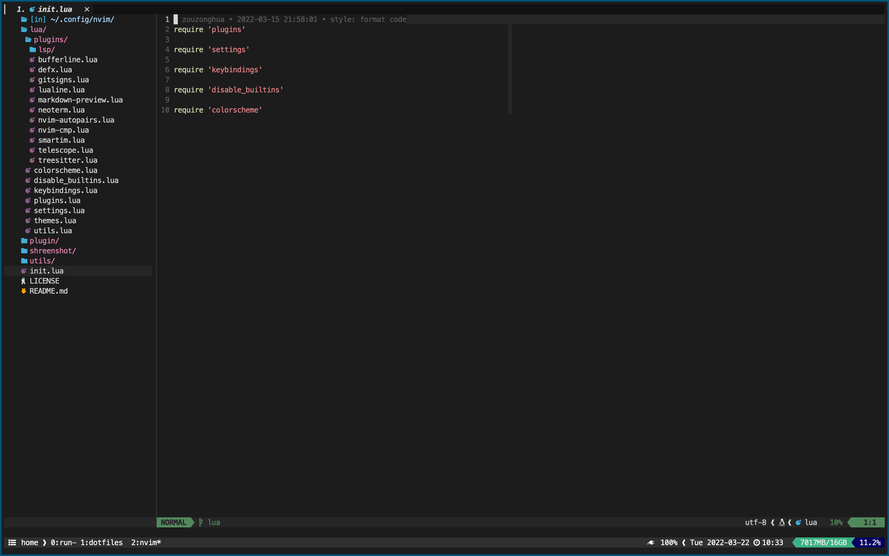

# nvim

[](https://github.com/zouzonghua/nvim/blob/main/LICENSE)
my neovim settings


## installation

```sh
sh <(curl -L https://github.com/zouzonghua/nvim/raw/lua/utils/install.sh)
```

## plugin

### PluginManager

- packer.nvim <https://github.com/wbthomason/packer.nvim>

### Appearance

- lualine.nvim <https://github.com/nvim-lualine/lualine.nvim>
- bufferline.nvim <https://github.com/akinsho/bufferline.nvim>
- nvim-web-devicons <https://github.com/kyazdani42/nvim-web-devicons>

### Git

- gitsigns.nvim <https://github.com/lewis6991/gitsigns.nvim>

### Markdown

- markdown-preview.nvim <https://github.com/iamcco/markdown-preview.nvim>

### Editor

- nvim-autopairs <https://github.com/windwp/nvim-autopairs>
- editorconfig-vim <https://github.com/editorconfig/editorconfig-vim>
- nvim-treesitter <https://github.com/nvim-treesitter/nvim-treesitter>
- smartim <https://github.com/ybian/smartim>
- vim-beancount <https://github.com/nathangrigg/vim-beancount>

### Terminal

- neoterm <https://github.com/kassio/neoterm>

### FileExplorer

- defx-git <https://github.com/kristijanhusak/defx-git>
- defx-icons <https://github.com/kristijanhusak/defx-icons>
- defx.nvim <https://github.com/Shougo/defx.nvim>

### Search

- telescope.nvim <https://github.com/nvim-telescope/telescope.nvim>
- plenary.nvim <https://github.com/nvim-lua/plenary.nvim>

### Lsp

- nvim-lspconfig <https://github.com/neovim/nvim-lspconfig>
- nvim-lsp-installer <https://github.com/williamboman/nvim-lsp-installer>
- null-ls.nvim <https://github.com/jose-elias-alvarez/null-ls.nvim>

### Cmp

- nvim-cmp <https://github.com/hrsh7th/nvim-cmp>
- cmp-nvim-lsp <https://github.com/hrsh7th/cmp-nvim-lsp>
- cmp-buffer <https://github.com/hrsh7th/cmp-buffer>
- cmp_luasnip <https://github.com/saadparwaiz1/cmp_luasnip>

### Snippets

- LuaSnip <https://github.com/L3MON4D3/LuaSnip>
- friendly-snippets <https://github.com/rafamadriz/friendly-snippets>

## # Colorscheme

- vim-code-dark <https://github.com/tomasiser/vim-code-dark>
